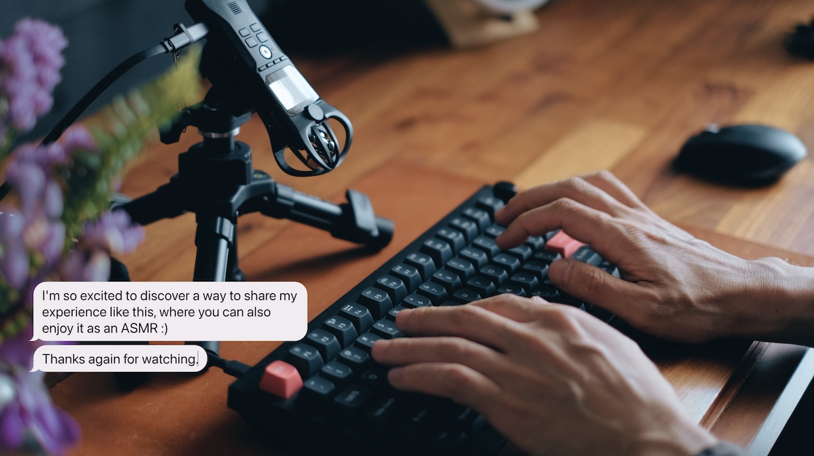

Chat bubble tool for YouTube
============================

A tool for recording typing animations and sounds with imitated chat UI.

- LIVE: https://ongedit.github.io/chat-bubbles-for-youtube/
- [Video tutorial](https://youtu.be/zu_vqAWHy_E)

Customisable bubble colour by [rackodo](https://github.com/rackodo).

Clone from: https://github.com/rackodo/chat-bubbles-for-yt

The main repo, live preview website don't working anymore so i clone to my github create the github action for deploy long live website

I think this never go down, if github page still live
